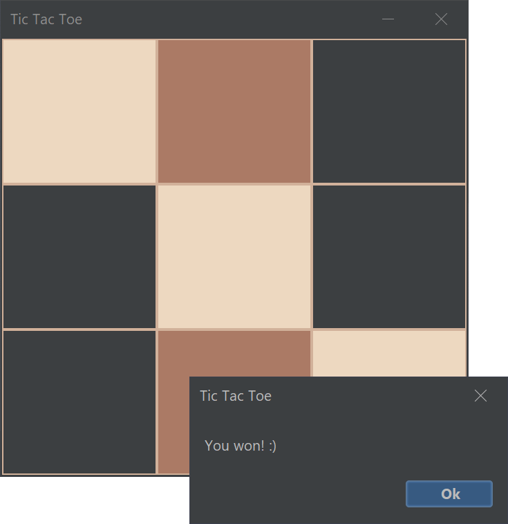

# TicTacToe (Not Finished)

  
  
  
  

<h4 align="center">The classic <b><a href="https://en.wikipedia.org/wiki/Tic-tac-toe">Tic-tac-toe</a></b> game with AI made in Java. Simpler. Cleaner. Beautiful. 
What more do you want?</h4>

  <a href="#about">About 📚</a> •
  <a href="#download">Download 📦</a> •
  <a href="#license">License 📜</a>

  

## About 📚
Everyone knows or has ever played the famous game <b><i>Tic-tac-toe</i></b>. This is a different version, much simpler, cleaner and beautiful.
This game has 3 different difficulty levels incorporated, which are:
  - <b>`Random`</b>: The machine plays its moves in random squares, so its pretty easy to win.
  - <b>`Pseudo-Random`</b>: The machine makes its moves randomly inside positions that avoid you to win. If it has the opportunnity to win, it does so.
  - <b>`Custom`</b>: The machine generates all the possible moves that it can do or you can do and it explores them till a specified depth by the user. Then, the
    AI selects the move that has the most promising future.

#### <ins>The current finished levels are:</ins> `Random`, `Pseudo-Random`

## Download 📦
You can download the newer version of this game with <a href="">this link</a>. You can also run `git clone https://github.com/Filipondios/TicTacToe.git` or similar
if you want full access to the code, as usual.

## License 📜
GNU - See the license <a href="LICENSE">file</a>.
